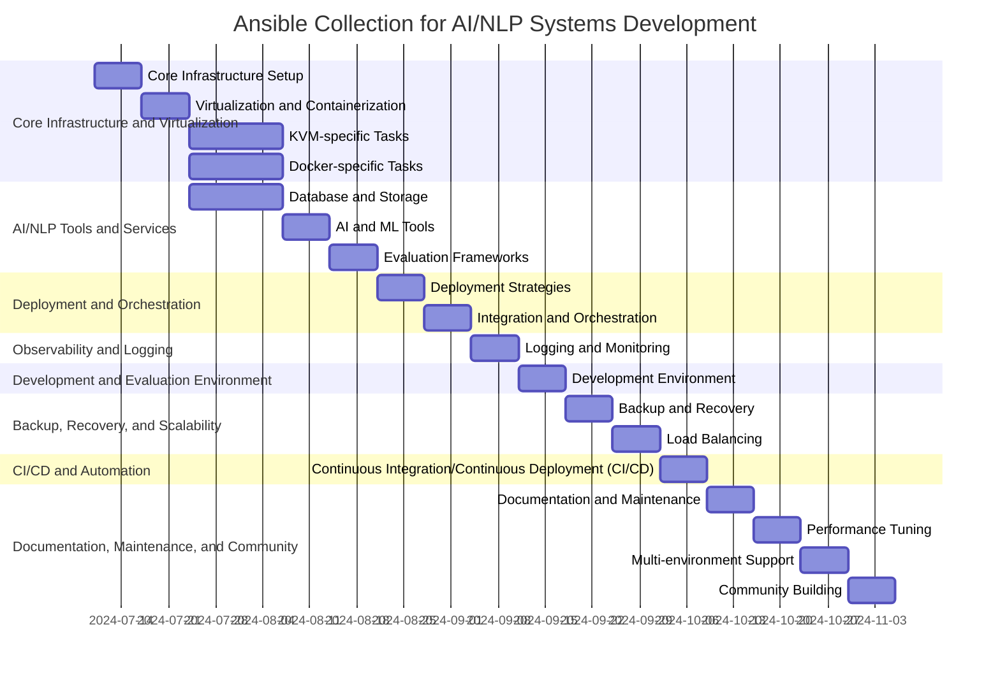

# Backlog: Ansible Collection for AI/NLP Systems Development

This backlog combines the initial suggestions with your detailed breakdown of Ansible roles and playbooks, focusing on both Docker and KVM deployments.

**Epics:**

1. Epic 1 Core Infrastructure and Virtualization

2. Epic 2 AINLP Tools and Services
	- Sub-Epic: No-Code Evaluation Platform
3. Epic 3 Deployment and Orchestration

4. Epic 4 Observability and Logging

5. Epic 5 Development and Evaluation Environment

6. Epic 6 Backup, Recovery, and Scalability

7. Epic 7 CICD And Automation

8. Epic 8 Documentation, Maintenance, and Community

---

# Key Changes

- Sub-Epic: Introduced a sub-epic to group user stories related to the no-code evaluation platform.

- Focus: Maintained the focus on the Ansible collection as the primary deliverable while integrating the subcomponent's backlog.

- Priorities: Aligned the subcomponent's user story priorities with the overall backlog, ensuring high-level alignment.

This merged backlog provides a comprehensive roadmap for developing a powerful and flexible Ansible collection for AI/NLP system development, supporting both Docker and KVM deployments.

---

[[readme]]
